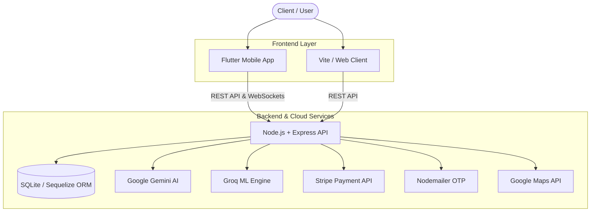

# CraftGo — AI-Powered Artisan Marketplace & Exhibition Management Platform

<div align="center">


**An intelligent end-to-end digital ecosystem connecting local artisans, handicraft enthusiasts, and exhibition organizers.**

</div>

---

## About CraftGo

**CraftGo** is a cross-platform mobile and web application designed to empower independent artisans and handicraft creators. By bridging traditional craftsmanship with artificial intelligence, CraftGo enables customers to request custom hand-made items, discover local exhibitions, and purchase unique artisanal goods while providing artisans with a robust dashboard to manage products, orders, and event registrations.

---

## Key Features

### 1. Artisan Workspace & Studio
- **Product Management:** Catalog creation with image uploads, dynamic pricing, and stock tracking.
- **Custom Order Requests:** Direct negotiation and custom order status tracking with buyers.
- **Exhibition Registration:** Apply and book spaces for upcoming craft fairs and exhibitions.
- **Story Feed:** Post updates, behind-the-scenes craft stories, and build a brand following.
- **Sales Analytics:** Real-time revenue insights and order state management.

### 2. Customer AI Craft Generator & Marketplace
- **AI Custom Craft Order:** Prompt engine powered by **Google Gemini AI** and **Groq ML** that translates customer design ideas into structured custom craft orders and matches them with qualified artisans.
- **Exhibition Explorer:** Discover nearby craft exhibitions with **Google Maps** integration.
- **Seamless Checkout:** Secure online payment processing via **Stripe Gateway**.
- **Real-Time Order Tracking:** Live order updates via WebSockets (**Socket.IO**).

### 3. Exhibition Owner Portal
- **Event Creation:** Organize local and international handicraft exhibitions.
- **Space & Booth Allocation:** Manage artisan application verification and booth assignments.
- **Ticket & Event Analytics:** Track participating craftsmen and visitor attendance.

### 4. Platform Admin Management
- **Verification Workflow:** Review artisan identity and exhibition owner credentials.
- **Dispute Resolution:** Built-in dispute ticket handling system to ensure buyer/seller trust.
- **Platform Banners:** Publish marketing announcements and featured artisan highlights.

---

## Architecture & Tech Stack



### Mobile & Web Client
- **Framework:** Flutter 3.x (Dart) & Vite/React Web Platform
- **UI/UX:** Material 3, Google Fonts (`Inter` / `Outfit`), Responsive Layouts
- **State & Storage:** `shared_preferences`, `socket_io_client`, `http`

### Backend & APIs
- **Runtime:** Node.js (v18+) with Express.js (v5)
- **Database & ORM:** SQLite with Sequelize ORM
- **Real-Time Engine:** Socket.IO
- **AI & ML Integration:** `@google/generative-ai`, `groq-sdk`
- **Payment & Security:** Stripe Node API (`stripe`), JWT authentication, Bcrypt password hashing
- **Communications:** Nodemailer SMTP for OTP verification & email notifications

---

## Repository Structure

```
CraftGo/
├── craftgo/                        # Flutter Mobile Application
│   ├── lib/                        # App source code
│   │   ├── screens/                # UI Screens (Admin, Artisan, Customer, Exhibitions)
│   │   ├── services/               # API, Payment, Customer, and Auth Services
│   │   └── widgets/                # Reusable UI Components & Modals
│   ├── android/                    # Android Native Config
│   ├── ios/                        # iOS Native Config
│   └── pubspec.yaml                # Flutter Dependencies
│
├── craftgo_backend/                # Node.js + Express REST API Server
│   ├── src/
│   │   ├── controllers/            # Route Logic (AI, Auth, Payment, Admin, Delivery)
│   │   ├── models/                 # Sequelize Database Models
│   │   ├── routes/                 # Express API Endpoint Routes
│   │   └── config/                 # Database & Cloud Configs
│   ├── server.js                   # Main Server Entry Point
│   ├── seed.js                     # Initial Database Seeding Script
│   └── package.json                # Node.js Dependencies
│
├── craftgo_web/                    # Web Client Platform
│   ├── src/                        # Web Source Code
│   ├── index.html                  # HTML Entry Point
│   └── package.json                # Web Dependencies
│
├── .gitignore                      # Comprehensive Git Ignore Rules
└── README.md                       # Project Documentation
```

---

## Getting Started

### Prerequisites
Make sure you have the following installed on your development machine:
- **Node.js** (v18.x or higher) & **npm**
- **Flutter SDK** (v3.10.x or higher)
- **Git**

---

### 1. Setting Up the Backend Server

```bash
# Navigate to the backend directory
cd craftgo_backend

# Install node dependencies
npm install

# Create environment configuration file
cp .env.example .env
```

Open `.env` and fill in your environment keys:
```env
PORT=5000
JWT_SECRET=your_jwt_secret_key
GEMINI_API_KEY=your_gemini_key
STRIPE_SECRET_KEY=sk_test_your_stripe_key
```

Run database migrations & seed sample data:
```bash
node seed.js
```

Start the Express development server:
```bash
npm run dev
# Server will run at http://localhost:5000
```

---

### 2. Running the Flutter Mobile App

```bash
# Navigate to the Flutter app directory
cd ../craftgo

# Install Flutter packages
flutter pub get

# Create Flutter environment configuration
cp .env.example .env

# Launch the app on an emulator or connected device
flutter run
```

---

### 3. Running the Web Client

```bash
# Navigate to the web directory
cd ../craftgo_web

# Install web dependencies
npm install

# Launch Vite development server
npm run dev
# Web app available at http://localhost:5173
```

---

## Environment Variables Reference

| Variable | Description |
| :--- | :--- |
| `PORT` | Backend server port (Default: `5000`) |
| `JWT_SECRET` | Secret key for signing authentication JSON Web Tokens |
| `GEMINI_API_KEY` | Google Gemini AI API key for custom craft order analysis |
| `GROQ_API_KEY` | Groq SDK API key for accelerated ML responses |
| `STRIPE_SECRET_KEY` | Stripe secret key for payment intent creation |
| `STRIPE_PUBLISHABLE_KEY` | Stripe publishable key for client SDK |
| `EMAIL_USER` / `EMAIL_PASS` | SMTP credentials for sending OTP verification emails |
| `GOOGLE_MAPS_API_KEY` | Google Maps API key for spatial location picking |

---

## Team & Credits

CraftGo was developed as a Software Engineering Graduation Project at **An-Najah National University** by:

- **[Khadija Almasry](https://github.com/khadijaalmasry)**
- **[Maram Salmeyeh](https://github.com/Maram283)**

---

## License

Distributed under the MIT License. See `LICENSE` for more details.

---

<div align="center">
  <sub>An-Najah National University — Software Engineering Graduation Project</sub>
</div>
